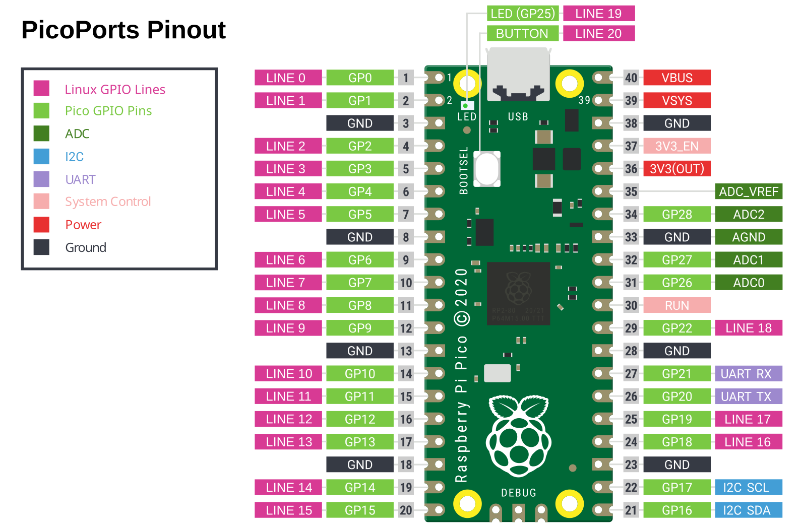

# PicoPorts

A USB-to-GPIO/ADC/I2C/UART interface based on the Raspberry Pi Pico 1.

The goal of this project is to be as easy as possible to setup and use. This is achieved by

- drag and drop firmware [installation](#installation)
- no driver installation on the host
- works with standard Linux tooling

## Usage

### Pinout

Pinout for the PicoPorts firmware variant with all interfaces:



Original image from [official Raspberry Pi documents](https://datasheets.raspberrypi.com/pico/Pico-R3-A4-Pinout.pdf).
Includes data from <https://pico.pinout.xyz>. Modified to include the Linux GPIO line numbers.

### GPIO

For GPIO access from the command line you can use the tools provided by the package `gpiod`

```bash
sudo apt install gpiod
```

Example: Find your gpio device number (look for "dln2" in the second column; here the gpio device is
`gpiochip1`)

```bash
gpiodetect
# Example output:
# gpiochip0 [INT34C6:00] (463 lines)
# gpiochip1 [dln2] (20 lines)
```

Example: Read GP0 (using gpio device `gpiochip1`)

```bash
gpioget gpiochip1 0
```

Example: Set GP8 high for 1 second (gpio states persist after gpioset command exits; using gpio
device `gpiochip1`)

```bash
gpioset gpiochip1 8=1
sleep 1
gpioset gpiochip1 8=0
```

Special case: Switch on Pico LED (connected to GP25; using gpio device `gpiochip1`)

```bash
gpioset gpiochip1 19=1
```

Special case: Read button state (can only be read)

```bash
gpioget gpiochip1 20
```

Example: Display button state on the LED

```bash
while true; do gpiomon --num-events=1 gpiochip1 20; gpioset gpiochip1 19=$(gpioget gpiochip1 20); done
# Stop with ctrl+z (suspend process) and "kill %%" (kill last suspended process)
```

There are two firmware variants. On with GPIOs and interfaces and one with GPIOs only. The gpiochip
line numbers depend on the firmware variant:

| Pico pin GP_              | GP0 | GP1 | GP2 | GP3 | GP4 | GP5 | GP6 | GP7 | GP8 | GP9 | GP10 | GP11 | GP12 | GP13 | GP14 | GP15 | GP16 | GP17 | GP18 | GP19 | GP20 | GP21 | GP22 | GP26 | GP27 | GP28 | GP25* | Button** |
|---------------------------|-----|-----|-----|-----|-----|-----|-----|-----|-----|-----|------|------|------|------|------|------|------|------|------|------|------|------|------|------|------|------|-------|----------|
| gpiochip line             |   0 |   1 |   2 |   3 |   4 |   5 |   6 |   7 |   8 |   9 |   10 |   11 |   12 |   13 |   14 |   15 |    - |    - |   16 |   17 |    - |    - |   18 |    - |    - |    - |    19 |       20 |
| gpiochip line (GPIO-only) |   0 |   1 |   2 |   3 |   4 |   5 |   6 |   7 |   8 |   9 |   10 |   11 |   12 |   13 |   14 |   15 |   16 |   17 |   18 |   19 |   20 |   21 |   22 |   23 |   24 |   25 |    26 |       27 |

*GP25 is connected to the LED

**Button is not connected via GPIOs, can only be read. Trying to set it will return the errno:
`EREMOTEIO 121 Remote I/O error`

#### Using multiple devices

When using multiple PicoPorts devices, it's not easy to determine the exact gpio device using
`gpiodetect`. We can use a `udev` rule to assign unique path's to the devices based on their device
ID and their path. This is done by the file `60-gpiochip.rules`. You can install it with:

```bash
sudo cp 60-gpiochip.rules /etc/udev/rules.d/
sudo udevadm control --reload
```

Then unplug and plug in the USB connection.

After installation, `udev` will create symlinks of the form:

- `/dev/gpio/by-id/usb-PicoPorts_GPIO_Expander_{{DEVICE_ID}}-if00`
- `/dev/gpio/by-path/{{BUS_PATH}}-platform-dln2-gpio.*.auto`

The `gpiod` tools accept device paths instead of `gpiochip*` identifiers.

Example: Read GP0 (using gpio device `/dev/gpio/by-id/usb-PicoPorts_GPIO_Expander_E660012345678901-if00`)

```bash
gpioget /dev/gpio/by-id/usb-PicoPorts_GPIO_Expander_E660012345678901-if00 0
```

### ADC

Example: Analog read of GP26/ADC0 (in volt)

```bash
echo "$(cat /sys/bus/iio/devices/iio:device0/in_voltage0_raw) * $(cat /sys/bus/iio/devices/iio:device0/scale)" | bc
```

Special case: Analog read of Pico VSYS (in volt)

```bash
echo "$(cat /sys/bus/iio/devices/iio:device0/in_voltage3_raw) * $(cat /sys/bus/iio/devices/iio:device0/scale) * 3" | bc
```

Special case: Analog read of Pico onboard temperature sensor (in degree Celsius)

```bash
echo "27.0 - ($(cat /sys/bus/iio/devices/iio:device0/in_voltage4_raw) * $(cat /sys/bus/iio/devices/iio:device0/scale) - 0.706) / 0.001721" | bc
```

The voltage index (`X` in `in_voltageX_raw`) depends on the firmware variant:

| Pico Pin                  | GP26/ADC0 | GP27/ADC1 | GP28/ADC2 | VSYS/3 | int. temp. |
|---------------------------|-----------|-----------|-----------|--------|------------|
| voltage index             |         0 |         1 |         2 |      3 |          4 |
| voltage index (GPIO-only) |         - |         - |         - |      0 |          1 |

### I2C

For I2C access from the command line you can use the tools provided by the package `i2c-tools`

```bash
sudo apt install i2c-tools
```

Example: Find your I2C device (look for "dln2-i2c" in the third column; here the I2C device is
`i2c-1`)

```bash
i2cdetect -l
# Example output:
# i2c-0   smbus   SMBus I801 adapter at efa0   SMBus adapter
# i2c-1   i2c     dln2-i2c-3-1.1:1.0-0         I2C adapter
```

Example: Scan for device on I2C bus using read operation* (using I2C device `i2c-1`)

```bash
i2cdetect -r 1
```

*I2C quick write is not supported, so detection has to use the read command (`-r` option).

Example: Write `0x40 0xff` to the device at I2C address `0x48` (using I2C device `i2c-1`)

```bash
i2cset 1 0x48 0x40 0xff
```

Example: Read data from the device at I2C address `0x48` (using I2C device `i2c-1`)

```bash
i2cget 1 0x48
```

Example: Attach kernel driver `pcf8591` for a Philips PCF8591 ADC/DAC at I2C address `0x48` (using
I2C device `i2c-1`)

```bash
echo pcf8591 0x48 | sudo tee /sys/class/i2c-adapter/i2c-1/new_device
# Example: Read value from first ADC channel
cat /sys/class/i2c-adapter/i2c-1/1-0048/in0_input
```

I2C is only available in the full firmware variant (not in the `GPIO-only` variant).

| Pico Pin | GP16 | GP17 |
|----------|------|------|
| I2C line |  SDA |  SCL |

### UART

Note: Many systems provide a symlink of the form
`/dev/serial/by-id/usb-PicoPorts_GPIO_Expander_{{DEVICE_ID}}-if01` which can be used instead of
`/dev/ttyACM*`.

Example: Open a serial terminal to interact with the UART (using tty device `/dev/ttyACM0` and `tio`
tool with default setting 115200:8n1)

```bash
tio /dev/ttyACM0
```

Example: Use custom UART settings (using tty device `/dev/ttyACM0` and `tio` tool)

```bash
tio /dev/ttyACM0 --baudrate 9600 --parity odd --stopbits 2 --databits 7
```

(supported parity: none, even, odd; supported stopbits: 1, 2; supported databits: 5, 6, 7, 8)

UART is only available in the full firmware variant (not in the `GPIO-only` variant).

| Pico Pin  | GP20 | GP21 |
|-----------|------|------|
| UART line |   TX |   RX |

## Installation

1. [Download the firmware](https://github.com/sevenlab-de/picoports/releases/latest).
2. Use [Drag-and-drop installation](https://www.raspberrypi.com/documentation/microcontrollers/micropython.html#drag-and-drop-micropython).
   1. Press and hold the `BOOTSEL` button on your Pico.
   2. Plug the Pico into your PC, the Pico will open as thumb drive.
   3. Copy the firmware onto the Pico thumb drive.

## Development

### Setup

```shell
git clone --no-recurse-submodules https://github.com/sevenlab-de/picoports.git
cd picoports
git submodule update --init -- pico-sdk
git -C pico-sdk submodule update --init -- lib/tinyusb
```

### Build

```shell
cmake -B build [-DGPIO_ONLY=yes] [-DLOG_ON_GP01=yes] [-DBOOTSEL_BUTTON=yes]
make -C build
# quick install:
cp build/picoports.uf2 /media/$USER/RPI-RP2/
```

- `GPIO_ONLY`: Disable interfaces, use all pins as GPIOs
- `LOG_ON_GP01`: Enable debug logging on GP0/GP1 (TX/RX resp.)
- `BOOTSEL_BUTTON`: Pressing the button resets the pico into BOOTSEL mode

### Theory of operation

PicoPorts works without a custom driver, because it's using a driver that already exists. The driver
called `dln2` (`gpio-dln2`, `dln2-adc`, `i2c-dln2`), was written for the Diolan DLN-2 USB adapter.
PicoPorts just implements the other side of the interface which the driver provides. It's mainly a
glue layer from this interface to the interface the Raspbery Pi Pico SDK has.

Since the `dln2` kernel driver does not support UART PicoPorts also adds a standard USB CDC ACM
interface and then also glues that to the Raspberry Pi Pico SDK interface.

Many thanks to the contributors who upstreamed the driver!

The **SPI** subsystem is troublesome in the kernel. While a `spi-dln2` driver exists, it's simply
not possible to attach a device driver to a hotpluggable SPI interface without major efforts from
the user, as the only way to attach a SPI device to an interface is via Devicetree/ACPI. As a
workaround, PicoPorts may in the future add a custom USB interface for SPI and add a tool which
works similarly to the `spidev` device driver, but in user space using `libusb`.

### Further resources

- All one needs to know about USB: <https://www.beyondlogic.org/usbnutshell/usb1.shtml>

### Licensing

This project is licensed under GPL-2.0-only. See [license text](./LICENSE).

### Trademark notice

Raspberry Pi is a trademark of Raspberry Pi Ltd.

PicoPorts runs on Raspberry Pi Pico.
